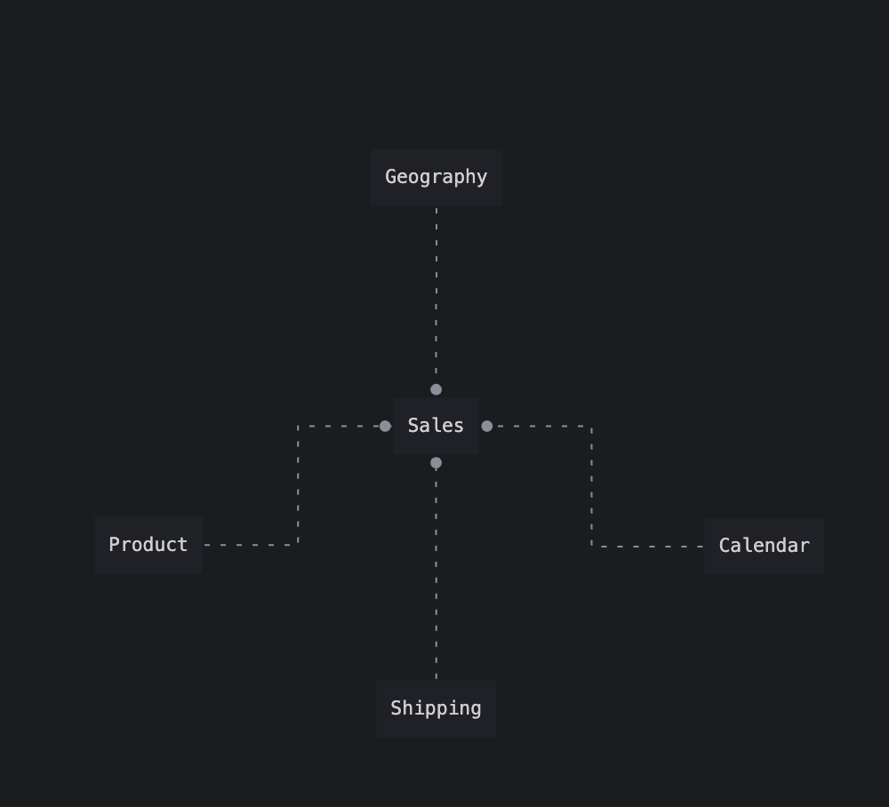
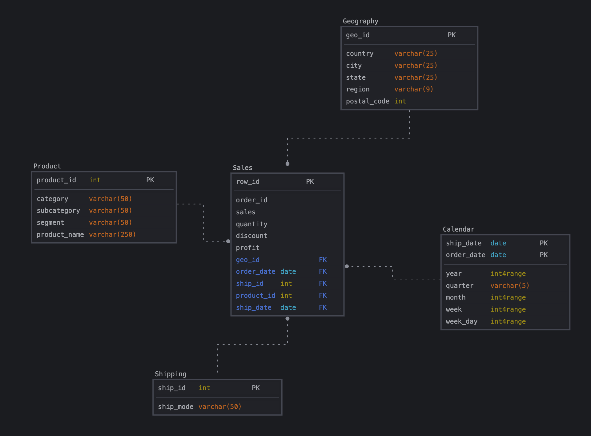

# Задания Module-02
[К оглавлению](https://github.com/Rusakltd/DE-101/blob/main/readme.md)

 > Для создания моделей использовал sqldbm на триале

## Концептуальная моделирование


## Логическое моделирование


## Физическое моделирование


## Код для создания таблиц по схеме модели
[SQL файл с кодом на создание таблиц по модели](create_tables.sql)
___

## Заполнение таблиц
[SQL файл с кодом по заполнению таблиц](insert_to_tables.sql)

При insert ... select решил такие нюансы:
### Geography
1. В основной таблице sales есть null значение в postal_code - их при заполнении
таблицы geography убрал, т.к. если считать что это обязательное поле, то данные 
должны быть, а null это ошибочные данные.
- Как вариант можно еще добавить через Insert все geoid по postal_code по городу где нет postal_code
2. Также по postal_code, есть дубль где одному postal_code соответствуют два значения города, проверил по факту, там один postal_code на два города. Как итог оставил уникальные geo_id для каждого из них.
### Calendar
Так как у нас два ключа `ship_date` и `order_date`, то тут три возможных варианта:
- Сделать composite key и через него заполнить уник значениями из sales
- Разделить значения по разными столбцам в Calendar для каждого из типов дат
- Разбить каждую строку на две с данными по `ship_date` и `order_date` и добавить тип даты.

Выбрал вариант с `composite key` и столкнулся с проблемой что date не парсится в int4range, так что изменил их на numeric:
```
ALTER TABLE calendar
	ALTER COLUMN year TYPE numeric USING lower(year)::numeric;
	ALTER COLUMN month TYPE numeric USING lower(month)::numeric;
	ALTER COLUMN week TYPE numeric USING lower(week)::numeric;
	ALTER COLUMN week_day TYPE numeric USING lower(week_day)::numeric;
```
## Sales
- Также как и в Geography при insert убрал строки где `postal_code` is null
- Перевел столбцы `quantity` и `row_id` из integer в оригинальной таблице в
int4range