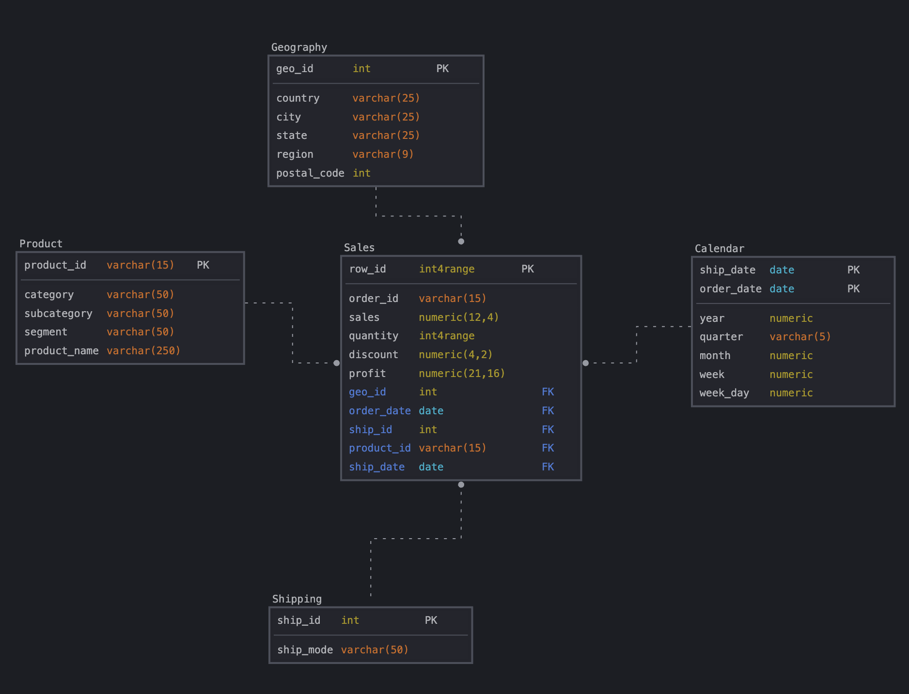

# Задания Module-02
[К оглавлению](https://github.com/Rusakltd/DE-101/blob/main/readme.md)


## Моделирование
 > Для создания моделей использовал sqldbm на триале

### Концептуальная моделирование


### Логическое моделирование


### Физическое моделирование


### Код для создания таблиц по схеме модели
[SQL файл с кодом на создание таблиц по модели](create_tables.sql)
___

## Заполнение таблиц
[SQL файл с кодом по заполнению таблиц](insert_to_tables.sql)

При insert ... select решил такие нюансы:

### Geography
В основной таблице sales есть null значение в postal_code - Добавил через Update все geoid по postal_code по штату и городу где нет postal_code
```
UPDATE geography
SET postal_code = '05401'
where city = 'Burlington' and state = 'Vermont' and postal_code is null;
```

### Calendar
Обновленное решение:
Сгенерировал календарь через скрипт и стал одним вместо двух:
```
insert into calendar
select 
to_char(date,'yyyymmdd')::int as dateid,  
       extract('year' from date)::int as year,
       extract('quarter' from date)::int as quarter,
       extract('month' from date)::int as month,
       extract('week' from date)::int as week,
       date::date,
       to_char(date, 'dy') as week_day,
       extract('day' from
               (date + interval '2 month - 1 day')
              ) = 29
       as leap
  from generate_series(date '2000-01-01',
                       date '2030-01-01',
                       interval '1 day')
       as t(date);
```

<details>
  <summary>Старое первое решение</summary>
  
  Так как у нас два ключа `ship_date` и `order_date`, то тут три возможных варианта:
- Сделать composite key и через него заполнить уник значениями из sales
- Разделить значения по разными столбцам в Calendar для каждого из типов дат
- Разбить каждую строку на две с данными по `ship_date` и `order_date` и добавить тип даты.

Выбрал вариант с `composite key` и столкнулся с проблемой что date не парсится в int4range, так что изменил их на numeric:
```
ALTER TABLE calendar
	ALTER COLUMN year TYPE numeric USING lower(year)::numeric;
	ALTER COLUMN month TYPE numeric USING lower(month)::numeric;
	ALTER COLUMN week TYPE numeric USING lower(week)::numeric;
	ALTER COLUMN week_day TYPE numeric USING lower(week_day)::numeric;
```
</details>

### Sales
- Также как и в Geography при insert убрал строки где `postal_code` is null
- Перевел столбцы `quantity` и `row_id` из integer в оригинальной таблице в
int4range

## Работа с облаком
1. Развернул PostgreSQL в Amazon Lightsail
2. Подключился с помощью DBeaver, развернул staging - [SQL Файл с кодом](stg.orders.sql)
3. Развернул dw - [SQL Файл с кодом](from_stg_to_dw.sql)