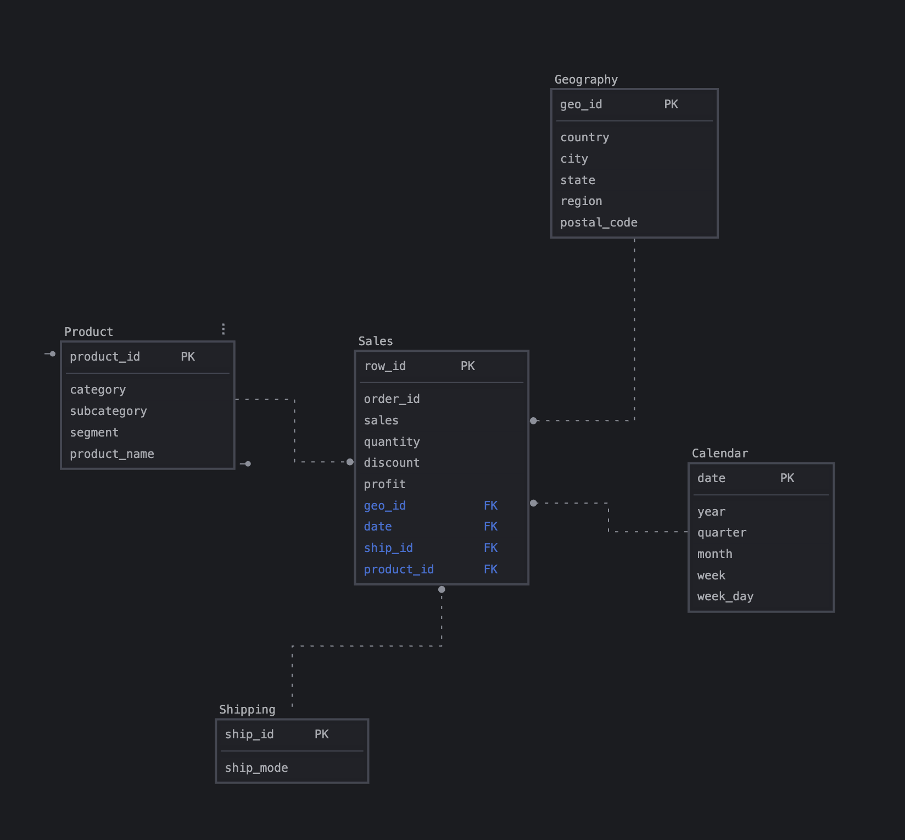

# Задания Module-02
Для создания моделей использовал sqldbm на триале

## Концептуальная моделирование

## Логическое моделирование

## Физическое моделирование

## Код для создания таблиц по схеме модели
[SQL файл sales](sales.sql)